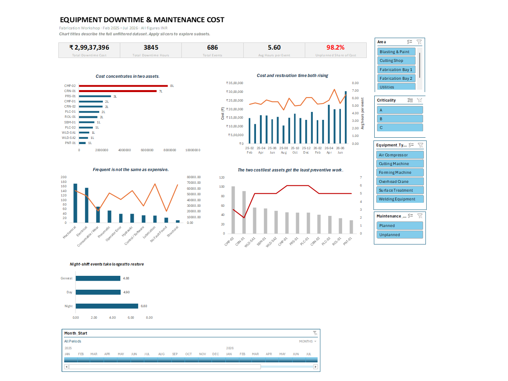
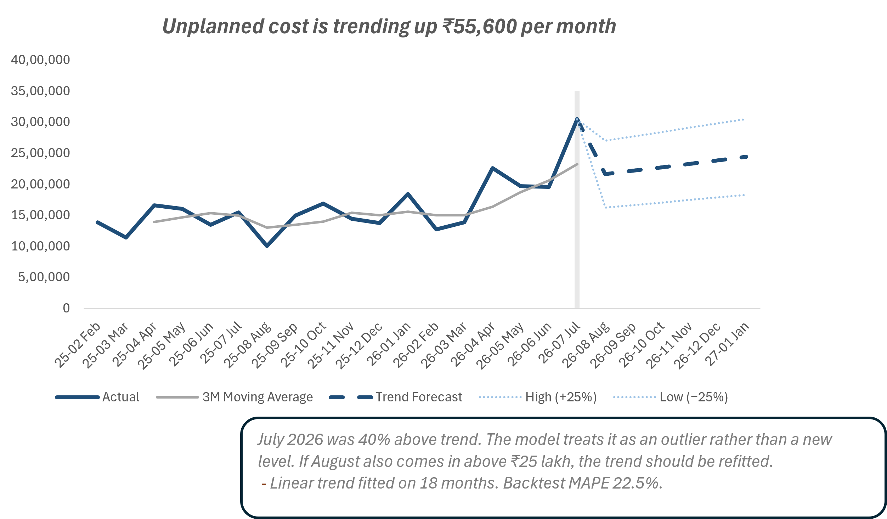
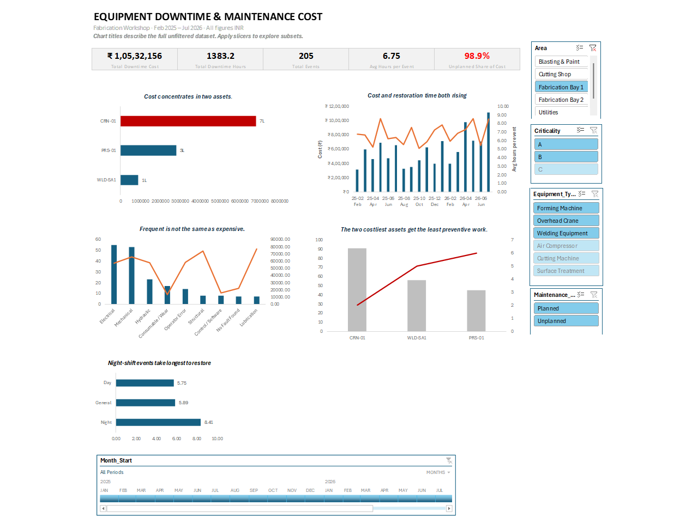

# Equipment Downtime & Maintenance Cost Analysis

**The workshop's log recorded hours, not money. Costing 686 downtime events across parts, labour and production loss put ₹2,99,37,396 on 18 months of downtime — and showed two of twelve assets carrying 49% of it.**

---

## The problem

A fabrication workshop was logging every breakdown properly. What it could not do was answer the question the log was collected for.

Management could see that a month had 42 hours of downtime. They could not see what that cost, because the log recorded **hours** and the money sat in three places: parts cost in the log, a labour rate held separately, and production loss that was never written down anywhere.

So downtime got treated as a fixed cost of running a workshop, rather than as something concentrated in specific machines, failure types and shifts — and preventive maintenance got allocated by habit instead of by exposure.

*Synthetic dataset, modelled on real fabrication workshop maintenance log structure.*

---

## The data

- **686 downtime events**, Feb 2025 to Jul 2026 (18 months)
- **12 assets** across **6 equipment types** and **4 areas**
- **3,845.0 downtime hours** — 3,579.2 unplanned, 265.8 planned
- A separate rate table supplying labour and production-loss rates by equipment type

**Cost was not in the file.** `Parts_Cost_INR` covered spares only. Everything else had to be constructed — and how you construct it determines every number downstream.

---

## What it found

**Cost concentrates in two machines.** CMP-02 and CRN-01 account for **49% of total downtime cost**. Spreading maintenance attention evenly across twelve assets spends it in the wrong place.

**A matched pair makes the preventive case better than any average could.** CMP-01 and CMP-02 are the same equipment type in the same workshop. CMP-01 received **6 preventive jobs and cost ₹21 lakh**. CMP-02 received **3 and cost ₹78 lakh** — 3.7 times the cost on half the preventive work.

**Frequency is not cost.** The failure types that occur most often are not the ones that cost most. Ranking by event count — which is how most maintenance registers are read — points at the wrong problem.

**Restoration is getting slower.** Mean time to restore has worsened **19%** over the period, and night-shift events take longest. That is a staffing and spares-access finding, not an equipment one.

**The trend is upward.** Unplanned cost is rising **₹55,600 per month** on a linear fit, projected six months forward with ±25% bands and **backtested at 22.5% MAPE**.

---

## What I built

- **A three-component cost model** — parts + (hours × labour rate) + (hours × production-loss rate), with rates held as **editable Power Query parameters** so the client recosts 18 months by changing one cell
- **One stated assumption:** planned maintenance carries no production loss. This is what produces the 98.2% unplanned share, and it is the first thing a client should confirm
- **Eight control checks** reconciling event count, hours split and subtotals to source before any analysis was built
- **Five analysis blocks** — cost summary, asset Pareto, failure-type breakdown, preventive-versus-breakdown, monthly restoration trend with shift sub-analysis
- **An interactive dashboard** — five KPI cards, five charts, four slicers and a timeline. Filtering to Fabrication Bay 1 returns ₹1,05,32,156 across 205 events, so the model holds under subsetting
- **A forecast tab** — 3-month moving average, linear trend, six-month projection, backtested against three held-out months

---

## What this does not prove

**The CMP pair is an association, not a causal result.** Two assets is not a sample. Duty cycle, age or operator could produce the same picture. It justifies a trial on CMP-02, not a published return figure.

**The headline is sensitive to the production-loss rate**, which was supplied rather than measured. The rankings and concentration findings are far more robust than the absolute total, because they depend on relative cost.

**July 2026 came in 40% above trend** and is treated as an outlier rather than a new level. If August also exceeds ₹25 lakh, the trend should be refitted — a decision rule the client can apply without reopening the model.

---

## Tools

Excel 365 · Power Query (M) · Data Model · Pivot Tables · Slicers & Timeline

## Files

| File | What it is |
|---|---|
| `Equipment_Downtime_Analysis.xlsx` | Full workbook — Read Me, Data, Analysis, Dashboard, Forecast |
| `case_study.md` / `case_study.pdf` | Full write-up |
| `scope_note.pdf` | The scope document written before the data was opened |
| `data/` · `images/` | Source log with rate table, and exports |

---

*I spent 12 years in QA/QC on refinery, steel plant and fabrication projects — IOCL Paradip, Jindal Steel Angul, Tata Steel HSM. The assumption in this model about planned maintenance and production loss comes from having scheduled that work on live plants, not from a tutorial.*

**Contact:** skbiswal5244@gmail.com

**More Work:** https://sudhansu-biswal.notion.site/Sudhansu-Kumar-Biswal-Data-Analyst-3d6edd782f3981adaef7cad049c77368
